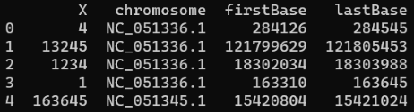

# PrimerDesigner
[](https://github.com/dpatrinos/PrimerDesigner/blob/main/LICENSE)

A python-based CLI that uses the NCBI mRatBN7.2 assembly to create fasta files for the creation of primers to target exon-exon junctions

## Installation

```sh
$ git clone https://github.com/dpatrinos/PrimerDesigner.git
$ pip install -e primerdesigner
```

## Usage

### Generate sequences from chromosome number and intron start and stop coordinates

```sh
$ primerdesigner -c --chromosome 1 --startPos 163310 --stopPos 163645 --destination /path/to/destination

### OUTPUT
# Chromosome 1 sequence loaded
# 300bp sequence length constructed
# chr1_163310-163645.fasta created in /path/to/destination
```

### Generate sequences from an X-labeled splice junction dataset

```sh
$ primerdesigner -s --intronX 1 --sjPath /path/to/sjdblist.csv --destination /path/to/destination

### OUTPUT
# Novel intron 1
# NC_051336.1: 163310:163645
# Chromosome 1 sequence loaded
# 300bp sequence length constructed
# chr1_163310-163645.fasta created in /path/to/destination
```

The splice junction dataset needs to be a .csv or .tab file organized as follows:
 


## Acknowledgements

 - [National Center for Biotechnology Information](https://www.ncbi.nlm.nih.gov/data-hub/taxonomy/10116/)
 - Jacob S. Roberts, Ron A. Perets, Kathryn S. Sarfert, John J. Bowman, Patrick A. Ozark, Gregg B. Whitworth, Sarah N. Blythe, and Natalia Toporikova, High-fat high-sugar diet induces polycystic ovary syndrome in a rodent model, *Biology of Reproduction*, Volume 96, Issue 3, March 2017, Pages 551–562, https://doi.org/10.1095/biolreprod.116.142786
 - Washington and Lee University Summer Research Scholars Program, Lexington, VA

## License

PrimerDesigner is released under an [GNU General Public License v3.0](https://github.com/dpatrinos/PrimerDesigner/blob/main/LICENSE) license.

